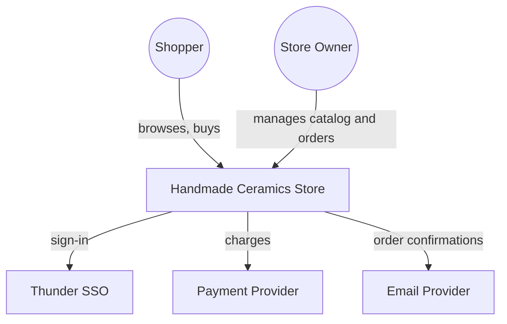
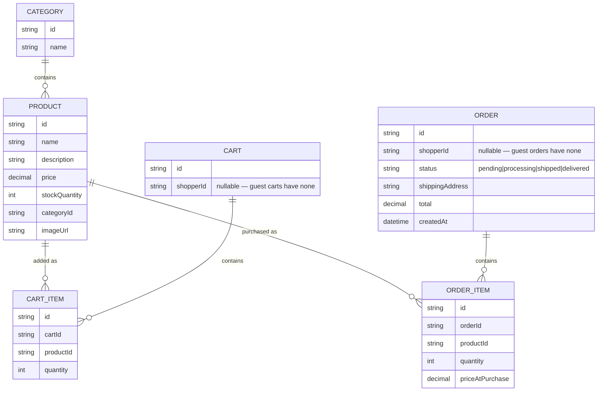
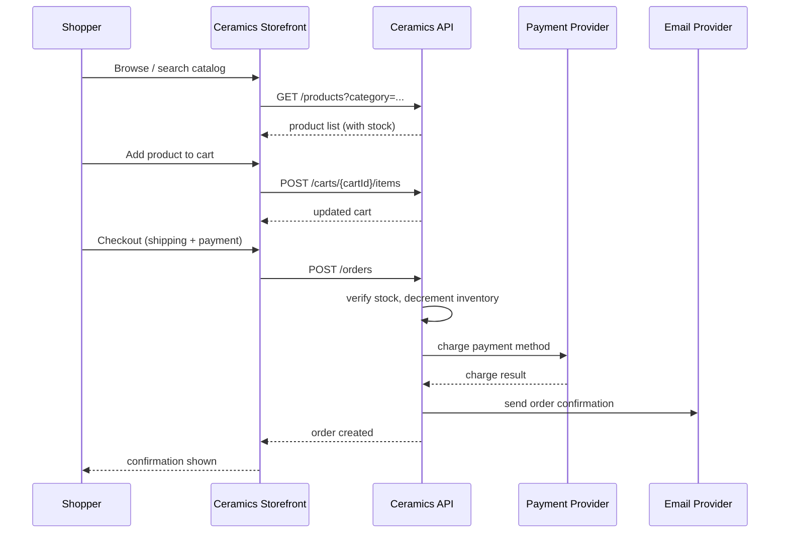
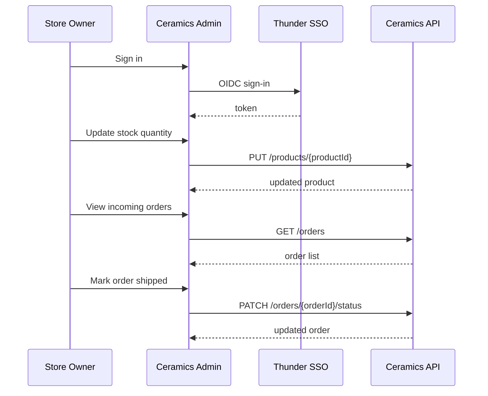

# Handmade Ceramics Store — Design

A single-shop online store: the **Ceramics Storefront** lets shoppers browse
the catalog, manage a cart, and check out as a guest or signed-in customer;
the **Ceramics Admin** app lets the store owner manage the catalog, inventory,
and order fulfillment. Both web apps call the shared **Ceramics API**, which
persists catalog and order data, validates sign-in via Thunder SSO, and
integrates with a payment provider and a transactional email provider.

## Context (C1)

## Domain model (ER)

## Key flows

### Shopper browses, adds to cart, and checks out as a guest

### Store owner manages inventory and fulfills an order

